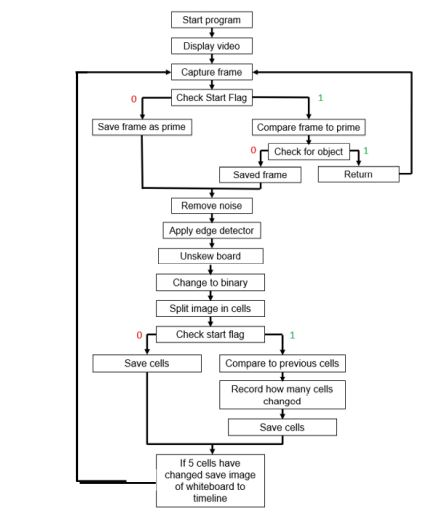

# Whiteboard-Capture-System
Webcam is used to capture a timeline of images throughout a teach session. The end product is the evolution of the content on a given whiteboard.

## Implementation
The implementation is based around two flags/booleans. 
- Start flag: On the first interation of the program the start flag is set to 0/false. This means no comparison of images will be performed to look for changes on content in the whiteboard. At the end of the first interation this flag is set to 1/true.
- Foregrnd Flag: This flag is initially set a 0/false. The first image caputred (prime) must be taken of a black whiteboard with no objects blocking the whiteboard. Each following images caputured are subtracted from the first image (prime) and if there is a considerable difference then an object must be preventing the camera from seeing the board. The foregrnd flag is set and the image is discarded as invalid.

